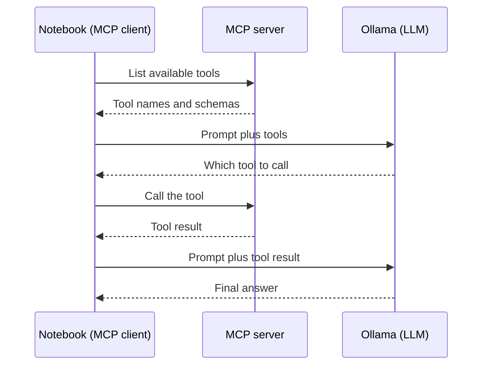

# Model Context Protocol (MCP)

This repository is a hands-on introduction to the Model Context Protocol (MCP) with large language models (LLMs). MCP lets an LLM use external tools, such as a calculator, a web search, or a Python interpreter, through a standard interface. You run local MCP servers and connect a local LLM to them.

## Learning Objectives

By the end of this repository, you should be able to:

- Describe how MCP connects an LLM to external tools through a client and a server.
- Build MCP servers that expose Python functions as tools.
- Connect a local LLM served by Ollama to MCP tools using tool calling.
- Implement an agent loop that chains tool calls, such as reading a file and then running code.
- Add conversation memory with Redis and keep the history short by summarizing it.

## Learning Path

The notebooks build on each other in order. In every notebook, the client asks the server for its tools, lets the LLM choose one, and calls it:



| File / Folder | Description |
|---|---|
| [**1 - Intro to MCP**](1_intro_to_MCP.ipynb) | Basic MCP usage with Llama 3.2 models through Ollama, from a simple math tool to web search and file reading. |
| [**2 - MCP Local Server**](2_MCP_local_server.ipynb) | Run local MCP servers, chain tools such as reading files and executing Python code, and use Chain of Thought prompting. |
| [**3 - MCP with Memory**](3_MCP_with_memory.ipynb) | Client-side chat history stored in Redis while connected to an MCP server over SSE. |

### Additional Folders and Files

| File / Folder | Description |
|---|---|
| [**MCP Servers**](mcp_servers/) | The MCP servers the notebooks connect to: `the_math_server.py`, `mcp_tools_server.py`, and `mcp_execute_python_server.py`. |
| [**Scripts**](scripts/) | Python scripts that the code-execution server can run. |
| [**AI Response**](ai_response.txt) | Sample text file that the notebooks ask the LLM to read and summarize. |
| [**Solutions**](solutions/) | Reference solutions. |
| [**pyproject.toml**](pyproject.toml) | Project configuration. |
| [**uv.lock**](uv.lock) | Dependency lock file. |

## Setup

> [!NOTE]
> Text in angle brackets like `<repo-name>` is a **placeholder**. Replace it, including the `< >` brackets, with your own value. For example, `cd <repo-name>` becomes `cd my-mcp-project`.

### 1. Create the Repository from the Template

Click **Use this template** on GitHub.

When creating the repository:

- Set yourself as the **Owner**
- Choose a repository name
- Disable **Include all branches**
- Click **Create repository**

---

### 2. Clone the Repository

Copy the SSH URL from the **Code** button on GitHub, then run:

```bash
git clone <copied-ssh-url>
```

The copied SSH URL will look like `git@github.com:<your-username>/<repo-name>.git`.

---

### 3. Move into the Project Folder and Install Dependencies

First [install uv](https://docs.astral.sh/uv/getting-started/installation/). Then `uv sync` installs all dependencies and creates a virtual environment in `.venv/`.

```bash
cd <repo-name>
uv sync
```

---

### 4. Install Ollama and Pull the Models

The notebooks use a local LLM served by Ollama.

```bash
brew install ollama
ollama pull llama3.2:1b
ollama pull llama3.2:3b
```

Start Ollama:

```bash
brew services start ollama
```

> [!NOTE]
> On Windows, download Ollama from the [Ollama download page](https://ollama.com/download/windows).

> [!TIP]
> You can also use other LLMs in this repository, such as those from Groq. Get a free API key in the [Groq console](https://console.groq.com/playground).

---

### 5. Install and Start Redis

Notebook 3 stores the chat history in Redis.

```bash
brew install redis
brew services start redis
```

Check that Redis is running:

```bash
redis-cli ping
```

You should see `PONG`.

---

### 6. Open the Notebooks

> [!NOTE]
> Make sure you open VS Code from the project root so it automatically detects the environment created by `uv sync`.

Launch VS Code in the project root folder:

```bash
code .
```

Then open a notebook and select the Python environment created by `uv sync` as the kernel.

## Usage

1. Set up your environment as described above.
2. Start with `1_intro_to_MCP.ipynb` to understand basic MCP concepts.
3. Proceed to `2_MCP_local_server.ipynb` for advanced server-based implementations.
4. In `3_MCP_with_memory.ipynb` you will find client-side Redis-backed chat history (memory) examples.
5. Explore the `mcp_servers/` folder to understand and modify the server implementations.

> [!NOTE]
> The notebooks tell you when to start a server. Run it from the project root in a separate terminal, for example `uv run python mcp_servers/the_math_server.py`. All servers listen on port `54321`, so stop the running server before you start another one.

## References & Further Reading

- [**Model Context Protocol**](https://modelcontextprotocol.io/): Official introduction and specification of MCP
- [**MCP Python SDK**](https://py.sdk.modelcontextprotocol.io/): Documentation for the library used to build the servers and clients
- [**Reference MCP Servers**](https://github.com/modelcontextprotocol/servers): Open-source MCP servers for files, databases, search, and more
- [**Ollama Tool Calling**](https://docs.ollama.com/capabilities/tool-calling): How a local model chooses and calls tools
- [**Llama 3.2 on Ollama**](https://ollama.com/library/llama3.2): The model family used in the notebooks
- [**Redis Documentation**](https://redis.io/docs/latest/): Reference for the store behind the chat memory
- [**uv Documentation**](https://docs.astral.sh/uv/): The package manager used in this repository
